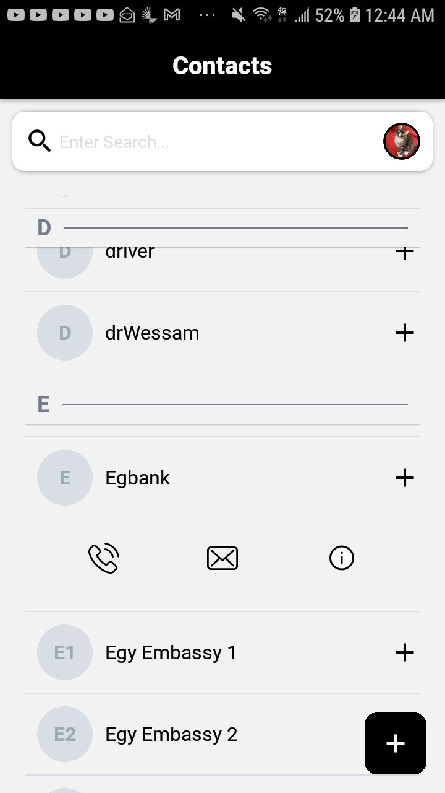
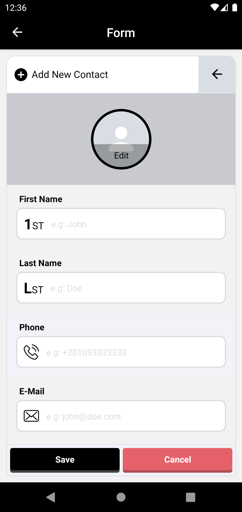
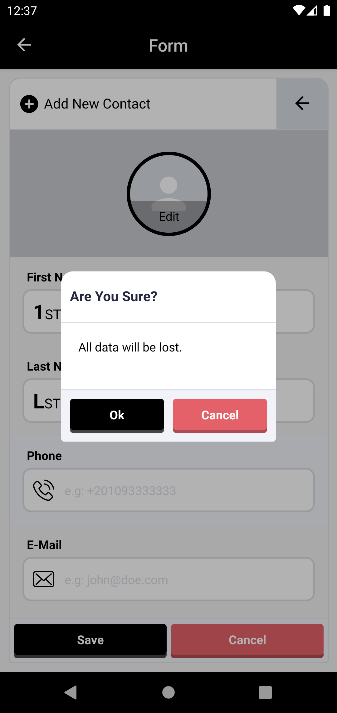
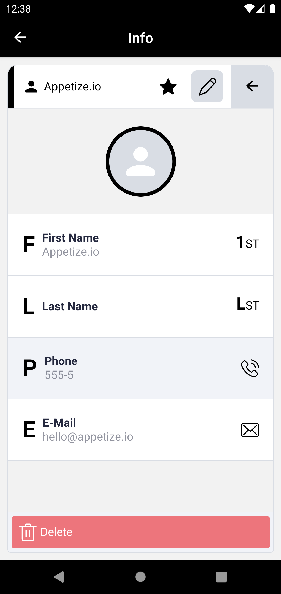

[](https://ramoun.me)


# Contacts

> A sample app for a contacts managment system. react native application that allows the user to add, delete, update the contact they want.

## Collective Screenshots of the APP [android]

<p align="center" justify="center">
  
  
  
  
</p>

## Outline of Building Process

0. Prepare Project Structuree, Dependecy Management, Build System, Linting System, and Application Configs.
1. Build a navgiation stack map
2. UI Breakdown to components (core components, navigation, layouts, pages)
3. Build components library (core building blocks of the app - under `src/components`)
4. Build a styling system using `styled-system` (including theme and global styles - under `src/styles`)
5. Add styling to core components
6. Build screens components (responsible for common layouts between pages - under `src/screens`)
7. Build stacks of the app (under `src/stacks`)
8. Build hooks and utility functions (under `src/hooks` and `src/utils`)
9. Add global state (using `Redux Toolkit` - under `src/state`)
10. Add animations (using `RN Animated`)
11. [Coming Soon] Unit Tests and Mocks.
12. [Coming Soon] Performance Optimization
13. [Coming Soon] Add Security Layers

## Built With

1. **Typescript**
2. **React Native**
3. **Styled System**
4. **Redux Toolkit**

## Showcase Videos

<div>
    <a href="https://www.loom.com/share/924c275f602142ea8c7ae24348bacf51">
      <p>Contacts App Showcase Part.1 - Watch Video</p>
    </a>
    <a href="https://www.loom.com/share/924c275f602142ea8c7ae24348bacf51">
      
    </a>
</div>

<div>
    <a href="https://www.loom.com/share/8269364a72c44c2ebeeb4dbcaae153a7">
      <p>Contacts App Showcase pt.2 - Watch Video</p>
    </a>
    <a href="https://www.loom.com/share/8269364a72c44c2ebeeb4dbcaae153a7">
      
    </a>
</div>

<div>
    <a href="https://www.loom.com/share/65e39714ecd44d6597556b225c10bf66">
      <p>Contacts App Showcase pt.3 - Watch Video</p>
    </a>
    <a href="https://www.loom.com/share/65e39714ecd44d6597556b225c10bf66">
      
    </a>
</div>

<div>
    <a href="https://www.loom.com/share/23b2dae1b6514182b69ef4da076f79be">
      <p>Contacts App Showcase Pt.4</p>
    </a>
    <a href="https://www.loom.com/share/23b2dae1b6514182b69ef4da076f79be">
      
    </a>
</div>


## How To Run Locally

> **Note**: Make sure you have completed the [React Native - Environment Setup](https://reactnative.dev/docs/environment-setup) instructions till "Creating a new application" step, before proceeding.

### Step 0: Install Dependencies

```bash
# 1. clone repository
git clone https://github.com/OmarRamoun/contacts.git

# 2. change current directory
cd contacts

# 3. Install all Dependencies
yarn install

# 4. Build Icons
yarn icons
```

### Step 1: Start the Metro Server

First, you will need to start **Metro**, the JavaScript _bundler_ that ships _with_ React Native.

To start Metro, run the following command from the _root_ of your React Native project:

```bash
# using Yarn
yarn dev # check package.json for more info
```

### Step 2: Start your Application

Let Metro Bundler run in its _own_ terminal. Open a _new_ terminal from the _root_ of your React Native project. Run the following command to start your _Android_ or _iOS_ app:

#### For Android

```bash
yarn android
```

#### For iOS

```bash
yarn ios
```

If everything is set up _correctly_, you should see your new app running in your _Android Emulator_ or _iOS Simulator_ shortly provided you have set up your emulator/simulator correctly.

## Author

👤 **Omar Ramoun**

- **GitHub**: [](https://github.com/omarramoun)
- **Twitter**: [](https://twitter.com/omarramoun)
- **LinkdIn**: [](https://www.linkedin.com/in/omarramoun/)

## 🤝 Contributing

Contributions, issues, and feature requests are welcome!

Feel free to check the [issues page](../../issues).

## Show your support

Give a ⭐️ if you like this project!
